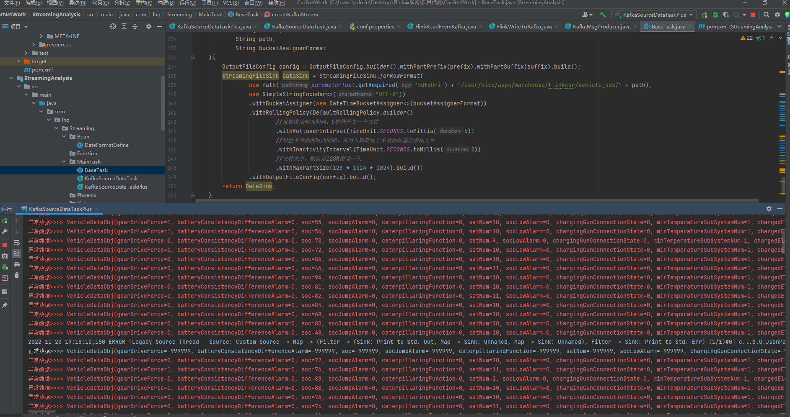
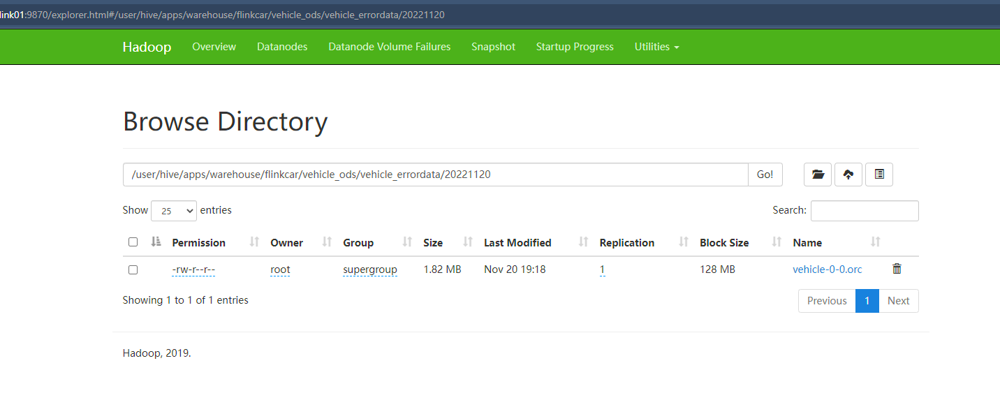
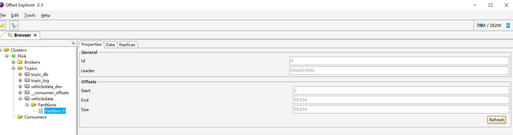
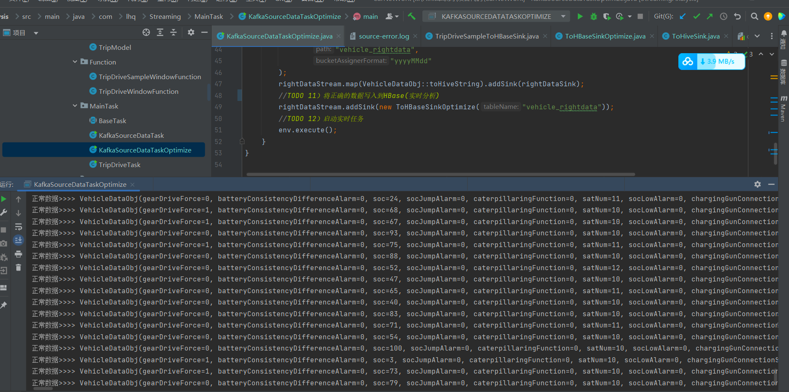

[TOC]


# 项目测试注意事项

## HDFS

### 退出HDFS的安全模式

```shell
hdfs fsck  /  -delete
```

## Kafka

### 重复消费

在代码第一次测试成功以后.



并且HDFS上也有数据文件生成



如果想要重复测试并且消费kafka分区里的同一份数据的话，就要修改conf.properties里的consumer_groupid，或者删除kafka分区，重新创建分区然后通过FlinkReadFromKafka方法重新将数据从HDFS上读取到Kafka里



因为想要重复的消费数据就要满足两个条件：

```properties
（1）使用一个全新的"group.id"（就是之前没有被任何消费者使用过）;
（2）指定"auto.offset.reset"参数的值为earliest；
```

从kafka-0.9版本及以后，kafka的消费者组和offset信息就不存zookeeper了，而是存到broker服务器上，所以，如果你为某个消费者指定了一个消费者组名称（group.id），那么，一旦这个消费者启动，这个消费者组名和它要消费的那个topic的offset信息就会被记录在broker服务器上。

第一个条件在代码里指定了，所以想要重复测试的话，只需要修改conf.properties里的consumer_groupid为一个全新的id即可

**或者使用KafkaTool删除kafka数据主题还有_consumer_offsets这个主题，然后重新运行flink程序读取到kafka分区，在删除掉分区及数据以后，要重启kafka集群(慎用)**


## HBase

在开发完正确数据写入HBase后，启动idea代码测试的时候，要先启动HDFS，Zookeeper，Kafka，HBase，然后通过命令hbase shell进入hbase的命令交互行创建表

```sql
#结尾没有分号
create 'vehicle_rightdata','cf'
```



然后在hbase shell里输入

```sql
scan 'vehicle_rightdata'
```

可以看到远远不断的数据写进来

针对原始数据实时ETL落地hbase，**设置好预分区，解决数据热点问题**，当已知rowkey的值的时候，设置预分区可以根据rowkey的区间进行分区

```
create 'vehicle_rightdata','cf',{SPLITS => ['10000','50000']}
```

针对hbase优化，可以从数据写入方式，预分区，预写日志等方面着手，可以通过**数据写入hbase合理使用压缩与编码**在同一磁盘空间上，存储更多的数据

```sql
1.alter 'vehicle_rightdata', { NAME => 'cf', DATA_BLOCK_ENCODING => 'FAST_DIFF' }
2.alter 'vehicle_rightdata',{NAME => 'cf',COMPRESSION => 'gz'}
```

