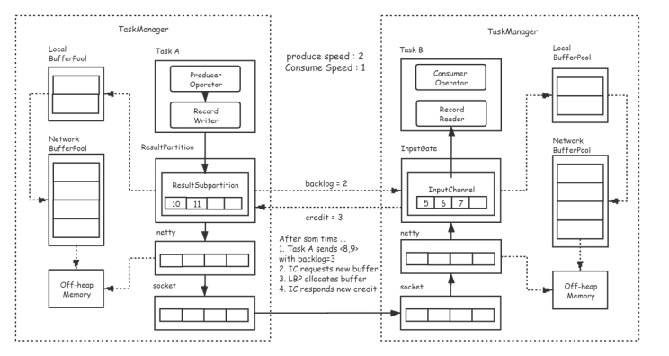
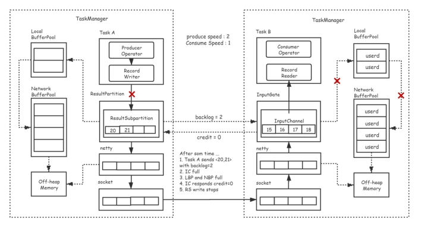
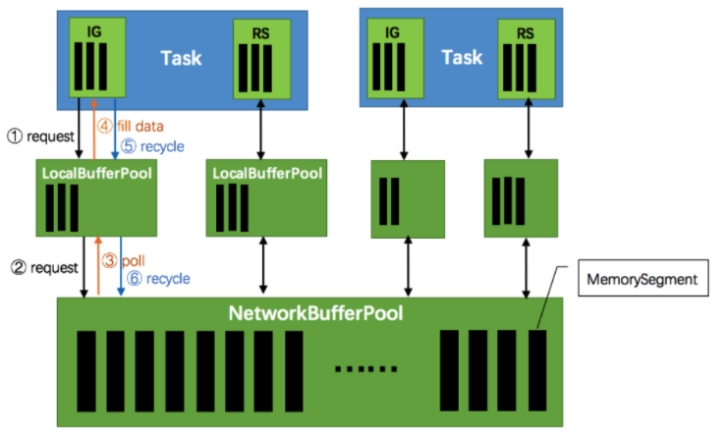
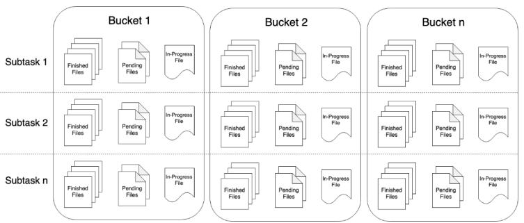
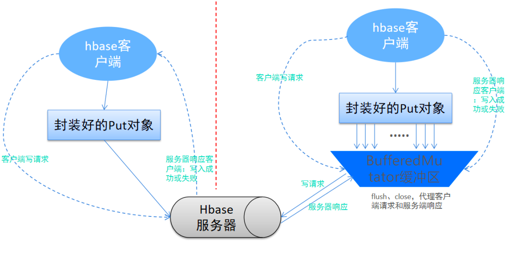

[TOC]


# 项目中涉及到的扩展知识

## 1.checkpoint

选择合适的Checkpoint存储方式

- CheckPoint存储方式存在三种

  - 官方文档：https://ci.apache.org/projects/flink/flink-docs-release-1.10/ops/state/state_backends.html

  - MemoryStateBackend、FsStateBackend 和 RocksDBStateBackend

  - 服务器中配置默认状态存储路径：flink-conf.yaml

```properties
#The backend that will be used to store operator state checkpoints
state.backend:filesystem 
#Directory for storing checkpoints 服务器环境存储多个挂载的本地磁盘为最优
# prod envirment file:///data/flink/checkpoints.指定所有的checkpoints数据和元数据存储的位置
state.checkpoints.dir:hdfs://namenode:8082/flink/checkpoints
```

- 不同 StateBackend 之间的性能以及安全性是有很大差异的。通常情况下，在代码中设置检查点存储，MemoryStateBackend 适合应用于测试环境，线上环境则最好选择存在挂在存储在磁盘上的FsStateBackend、RocksDBStateBackend。

- 这有两个原因：首先，RocksDBStateBackend 是外部存储，其他两种 Checkpoint 存储方式都是 JVM 堆存储。 受限于 JVM 堆内存的大小，Checkpoint 状态大小以及安全性可能会受到一定的制约；

- 其次，RocksDBStateBackend 支持增量检查点。增量检查点机制（Incremental Checkpoints）仅仅记录对先前完成的检查点的更改，而不是生成完整的状态。 与完整检查点相比，增量检查点可以显著缩短 checkpointing 时间，但代价是需要更长的恢复时间。

## 2.数据积压/背压/反压

### 什么是数据积压

流系统中消息的处理速度跟不上消息的发送速度，会导致消息的堆积，就是数据积压

### 数据积压的原因

垃圾回收卡顿可能会导致流入的数据快速堆积

一个数据源可能生产数据的速度过快

### 数据积压的后果

背压如果不能得到正确地处理，可能会导致 资源被耗尽 或者甚至出现更糟的情况导致数据丢失 在同一时间点，不管是流处理job还是sink，如果有1秒的卡顿，那么将导致至少500万条记录的积压。换句话说，source可能会产生一个脉冲，在一秒内数据的生产速度突然翻倍。

举例分析：

l 正常情况：消息处理速度 >= 消息的发送速度，不发生消息拥堵，系统运行流畅

 

l 异常情况：消息处理速度< 消息的发送速度，发生了消息拥堵，系统运行不畅

 

#### 积压解决方案

| 方案                                           | ***\*影响\****                                               |
| ---------------------------------------------- | ------------------------------------------------------------ |
| 删除拥堵消息                                   | 会导致数据丢失，许多流处理程序而言是不可接受的               |
| 将缓冲区持久化                                 | 方便在处理失败的情况下进行数据重放，会导致缓冲区积压的数据越来越多 |
| 缓存拥堵信息，告知消息发送者减缓消息发送的速度 | 对source进行限流来适配整个pipeline中最慢组件的速度，从而获得稳定状态 |

#### 解决数据积压方法

Flink内部自动实现数据流自然降速，而无需担心数据丢失。Flink所获取的最大吞吐量是由pipeline中***\*最慢的组件\****决定。

Flink1.5+ 版本引入了基于Credit的流控和反压机制，本质上是将TCP的流控机制从传输层提升到了应用层——InputGate和ResultPartition的层级，从而避免传输层造成阻塞。

 

仍然是Sender发送速度与Receiver接收速度的比是2:1的情景。Sender端的ResultSubPartition积压了2个缓存的数据，因此会将该批次要发送的数据与backlog size = 2一同发往Receiver。

Receiver收到当前批数据和backlog size之后，会计算InputChannel是否有足够的缓存来接收下一批数据，如果不够，则会去LocalBufferPool/NetworkBufferPool申请缓存，并将credit = 3通知到上游的ResultSubPartition，表示自己能够接收3个缓存的消息。

 

随着Receiver端的数据不断积压，网络缓存最终被耗尽，因此会反馈给上游credit = 0（相当于TCP滑动窗口中的window = 0），Sender端ResultPartition到Netty的链路会被阻断。按照上一节所述的流程，Sender端的网络缓存会被更快地耗尽，RecordWriter不能再写数据，从而达到反压的效果。

背后的原理：

 

- TaskManager（TM）启动时，会初始化网络缓冲池（NetworkBufferPool）

  - 默认生成 2048 个内存块（MemorySegment）

  - 网络缓冲池是Task之间共享的

  - Task线程启动时，Flink 会为Task的 Input Gate（IG）和 ResultSubpartition（RS）分别创建一个LocationBufferPool

    - LocationBufferPool的内存数量由Flink分配

    - 为了系统更容易应对瞬时压力，内存数量是动态分配的

  - Task线程执行时，Netty接收端接收到数据时，为了将数据保存拷贝到Task中

    - Task线程需要向本地缓冲池（LocalBufferPool）申请内存

    - 若本地缓冲池没有可用内存，则继续向网络缓冲池（NetworkBufferPool）申请内存

    - 内存申请成功，则开始从Netty中拷贝数据

    - 若缓冲池已申请的数量达到上限，或网络缓冲池（NetworkerBufferPool）也没有可用内存时，该Task的Netty Channel会暂停读取，上游的发送端会立即响应停止发送，Flink流系统进入反压状态

- 经过 Task 处理后，由 Task 写入到 RequestPartition （RS）中

  - 当Task线程写数据到ResultPartition（RS）时，也会向网络缓冲池申请内存

  - 如果没有可用内存块，也会阻塞Task，暂停写入

- Task处理完毕数据后，会将内存块交还给本地缓冲池（LocalBufferPool）
  - 如果本地缓冲池申请内存的数量超过池子设置的数量，将内存块回收给 网络缓冲池。如果没超过，会继续留在池子中，减少反复申请开销

## 3.Flink写filesystem

### 数据落地HDFS：StreamingFileSink

参见：https://ci.apache.org/projects/flink/flink-docs-release-1.10/zh/dev/connectors/streamfile_sink.html

这个连接器提供了一个 Sink 来将分区文件写入到支持 Flink FileSystem 接口的文件系统中。

Streaming File Sink 会将数据写入到桶中。由于输入流可能是无界的，因此每个桶中的数据被划分为多个有限大小的文件。如何分桶是可以配置的，默认使用基于时间的分桶策略，这种策略每个小时创建一个新的桶，桶中包含的文件将记录所有该小时内从流中接收到的数据。

桶目录中的实际输出数据会被划分为多个部分文件（part file），每一个接收桶数据的 Sink Subtask ，至少包含一个部分文件（part file）。额外的部分文件（part file）将根据滚动策略创建，滚动策略是可以配置的。默认的策略是根据文件大小和超时时间来滚动文件。超时时间指打开文件的最长持续时间，以及文件关闭前的最长非活动时间。

**重要: 使用 StreamingFileSink 时需要启用 Checkpoint ，每次做 Checkpoint 时写入完成。如果 Checkpoint 被禁用，部分文件（part file）将永远处于 'in-progress' 或 'pending' 状态，下游系统无法安全地读取。**

 

理解：

**由于我们用的是流任务，那么任务会一直持续进行，数据也会持续不断的写出，由于数据是源源不断的产生，那么就需要给数据设立边界，让其完成某个文件数据的写出。不然某个文件会一直处于写入状态中。**

那么StreamingFileSink就是一个写出流数据的类,它会将数据分桶（分part）写出到文件中，按照指定规则（时间、文件大小等），完成某一part的写入过程。

比如：每隔1小时或者每当文件大小达到比如1GB的时候，就完成当前文件的写入，将状态标记为Finished，然后开启一个新文件继续写流数据。

数据在写出之前，在Flink内部会按照各个子任务（并行）划分数据桶，每个桶可以包含多个part文件

文件在写的过程中有3个状态：

- In-progress ：当前文件正在写入中

- Pending ：当处于 In-progress 状态的文件关闭（closed）了，就变为 Pending 状态

- Finished ：在成功的 Checkpoint 后，Pending 状态将变为 Finished 状态

#### 文件格式

StreamingFileSink 支持行编码格式和批量编码格式，比如 Apache Parquet 。 这两种变体随附了各自的构建器，可以使用以下静态方法创建：

- Row-encoded sink: StreamingFileSink.forRowFormat(basePath, rowEncoder)
  - 一次写入一行数据

- Bulk-encoded sink: StreamingFileSink.forBulkFormat(basePath, bulkWriterFactory)
  - 一次写入一批数据, 如parquet、avro

**重要**：批量编码模式仅支持OnCheckpointRollingPolicy策略，在每次checkpoint的时候切割文件。

#### 桶分配逻辑

简单理解：如何划分桶

桶分配逻辑定义了如何将数据结构化为基本输出目录中的子目录

行格式和批量格式都使用 DateTimeBucketAssigner作为默认的分配器。 默认情况下，DateTimeBucketAssigner 基于系统默认时区每小时创建一个桶，格式如下： yyyy-MM-dd--HH 。日期格式（即桶的大小）和时区都可以手动配置。

我们可以在格式构建器上调用 .withBucketAssigner(assigner) 来自定义 BucketAssigner

Flink 有两个内置的 BucketAssigners ：

- DateTimeBucketAssigner默认基于时间的分配器

- BasePathBucketAssigner：将所有部分文件（part file）存储在基本路径中的分配器（单个全局桶）

内置的不满足需求可以自定义实现BucketAssigner

#### 滚动策略

简单理解：啥时候（按时间、按大小等）算完成1个文件的写入。

滚动策略 RollingPolicy定义了指定的文件在何时关闭（closed）并将其变为 Pending 状态，随后变为 Finished 状态。处于 Pending 状态的文件会在下一次 Checkpoint 时变为 Finished 状态，通过设置 Checkpoint 间隔时间，可以控制部分文件（part file）对下游读取者可用的速度、大小和数量。

Flink 有两个内置的滚动策略：

- DefaultRollingPolicy

  - 核心策略：

    - 当没有正在写入的part文件的时候，不工作,

    - 当文件达到最大桶大小的时候关闭文件完成写入 (by default 128MB)  可设置

    - 当前写入文件写入时长超过默认间隔 (by default 60 sec)	 可设置

    - 当前文件一定时间内没有写入(by default 60 sec).		可设置

- OnCheckpointRollingPolicy

  - 核心策略：

    - 当进行一次CheckPoint活动的时候，完成当前文件的写入（跟随检查点的节奏走）

    - 内置的不满足需求可以自定义实现RollingPolicy

## 4.HBase RowKey设计

### rowkey设计原则和方法

rowkey设计首先应当遵循三大原则：

#### RowKey的设计原则

##### 1.rowkey长度原则

rowkey是一个二进制码流，可以为任意字符串，最大长度为64kb，实际应用中一般为10-100bytes，它以byte[]形式保存，一般设定成定长。

**一般越短越好**，尽量不要超过16个字节\****，注意原因如下：

- 目前操作系统都是64位系统，内存8字节对齐，控制在16字节，8字节的整数倍利用了操作系统的最佳特性。

- hbase将部分数据加载到内存当中，如果rowkey过长，内存的有效利用率就会下降。

##### 2.rowkey散列原则

如果rowkey按照时间戳的方式递增，不要将时间放在二进制码的前面，建议将rowkey的高位字节采用散列字段处理，由程序随即生成。低位放时间字段，这样将提高数据均衡分布，各个regionServer负载均衡的几率。

**如果不进行散列处理，首字段直接使用时间信息，所有该时段的数据都将集中到一个regionServer当中，这样当检索数据时，负载会集中到个别regionServer上，造成热点问题，会降低查询效率。**

##### 3.rowkey唯一原则

必须在设计上保证其唯一性，rowkey是按照字典顺序排序存储的，因此，设计rowkey的时候，要充分利用这个排序的特点，将经常读取的数据存储到一块，将最近可能会被访问的数据放到一块。但是这里的量不能太大，如果太大需要拆分到多个节点上去。

#### 常用的rowkey设计方法

##### Salt加盐

Salt是将每一个Rowkey加一个前缀，前缀使用一些随机字符，使得数据分散在多个不同的Region，达到Region负载均衡的目标。

比如在一个有4个Region(**注：以 [ ,a)、[a,b)、[b,c)、[c, )为Region起至**)的HBase表中，

加Salt前的Rowkey：**abc001、abc002、abc003**

我们分别加上a、b、c前缀，加Salt后Rowkey为：**a-abc001、b-abc002、c-abc003**

可以看到，加盐前的Rowkey默认会在第2个region中，加盐后的Rowkey数据会分布在3个region中，理论上处理后的吞吐量应是之前的3倍。由于前缀是随机的，读这些数据时需要耗费更多的时间，**所以Salt增加了写操作的吞吐量，缺点是同时增加了读操作的开销**

##### Hash散列或者Mod

用**Hash散列**来替代随机Salt前缀的好处是能让一个给定的行有相同的前缀，这在分散了Region负载的同时，使读操作也能够推断。确定性Hash(比如md5后取前4位做前缀)能让客户端重建完整的RowKey，可以使用get操作直接get想要的行。

例如将上述的原始Rowkey经过hash处理，此处我们采用md5散列算法取前4位做前缀，结果如下：

9bf0-abc001 （abc001在md5后是9bf049097142c168c38a94c626eddf3d，取前4位是9bf0）

7006-abc002

95e6-abc003

若以前4个字符作为不同分区的起止，上面几个Rowkey数据会分布在3个region中。实际应用场景是当数据量越来越大的时候，这种设计会使得分区之间更加均衡。

如果Rowkey是数字类型的，也可以考虑Mod方法。

##### Reverse反转

针对固定长度的Rowkey反转后存储，这样可以使Rowkey中经常改变的部分放在最前面，可以有效的随机Rowkey。

反转Rowkey的例子通常以手机举例，可以将手机号反转后的字符串作为Rowkey，这样的就避免了以手机号那样比较固定		开头(137x、15x等)导致热点问题，**这样做的缺点是牺牲了Rowkey的有序性**

## 5.数据落地HBase优化

### 数据写入HBase自定义Sink代码优化

刚开始在自定义Sink将数据写入HBase的时候，重写invoke方法实现每条数据通过put操作写入到hbase中，每条数据就执行一次该方法，但是如果在某一时刻，数据量暴增的话，**极有可能会造成数据写入hbase的性能瓶颈**

所以针对这种一条条数据写入的方式，做了一些优化：

```mathematica
使用hbase客户端写缓存进行批量写入数据到hbase中:
    hbase的每一次put操作写入数据，实际上是一个RPC操作，将客户端的数据传输到hbase服务器再返回结果，适合小数据量写入，当需要写入大量数据时，每一次put连接一次RPC连接，会增加连接次数，因此会增加传输时间和IO消耗
hbase客户端写缓存对象:BufferedMutator:
   BufferedMutator通过mutate方法提交数据，put的数据一开始放在缓存区内，当数量到达指定的容量或者用户强制提交是才将数据一次性提交到HBase的服务器，flush方法可以强制刷新缓冲区提交数据，最后执行close方法之前也会刷新缓冲区
BufferedMutator错误处理:
   当通过BufferedMutator批量提交发生错误时触发绑定的BufferedMutator.ExceptionListener监听器实例的onException方法，其中RetriesExhaustedWithDetailsException记录了发生错误的内容及其提交的错误内容等信息，而其余正确的提交的内容则会正确放入HBase表中。
```

**使用BufferedMutator数据写与直接写数据到hbase的区别：**



### 数据写入HBase进行预分区

### 数据写入HBase预写日志

### 数据写入HBase合理使用压缩与编码
